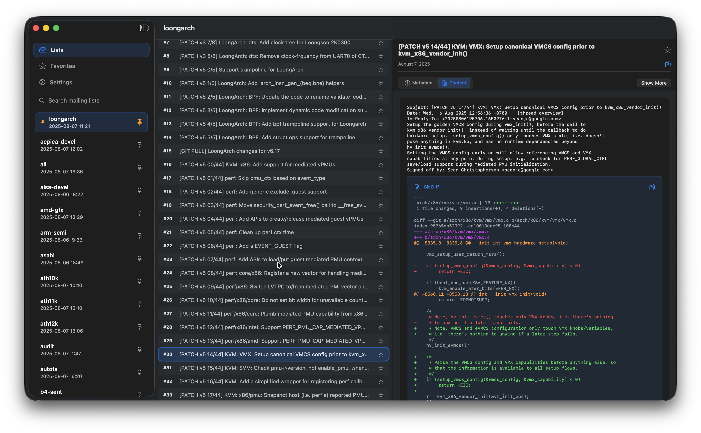

# listux

operating system development mailing list feed client, support MacOS and iOS.

_work in progress_

a https://lore.kernel.org/{channel} client for browsing linux kernel maillists topics and message rendering

## development

1. vscode: SweetPad, Swift
2. brew install xcode-build-server xcbeautify
3. SweetPad: Generate Build Server Config

log stream --predicate 'process == "Listux"'

params reference: https://blog.kworkflow.org/the-lore.kernel.org-api/

## credits

wheatfox 2025 wheatfox17@icloud.com